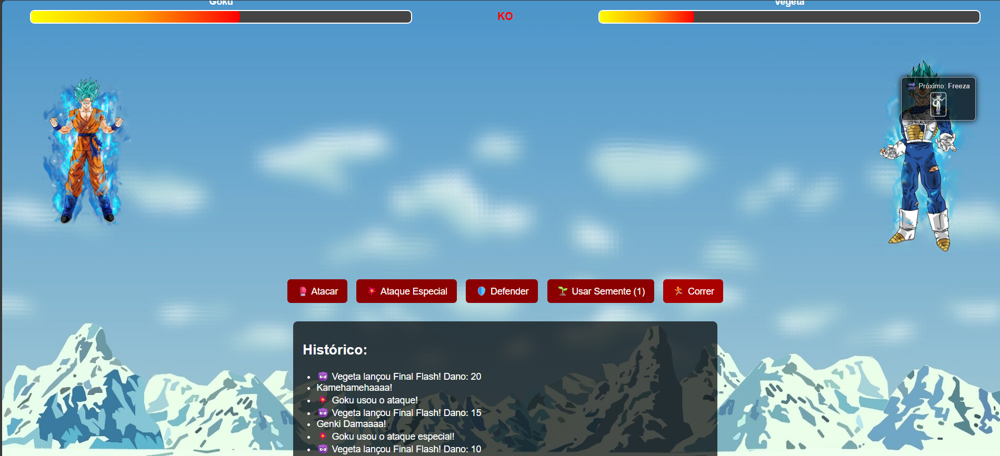

# 🐉 Dragon Ball Battle Game (Next.js)

Jogo interativo de luta por turnos com Goku enfrentando diversos vilões icônicos do universo Dragon Ball, como Vegeta, Freeza e Majin Boo. Desenvolvido com [Next.js](https://nextjs.org) e React, o jogo traz sons, imagens e animações para criar uma experiência divertida e dinâmica no navegador.

---

## 📸 Demonstração



---

## 🚀 Como Rodar o Projeto

1. Clone o repositório:

```bash
git clone https://github.com/victorxdking/programacao-script.git
cd "programacao-script/Aula 04/heroes-and-villains"
````

2. Instale as dependências:

```bash
npm install
```

3. Inicie o servidor de desenvolvimento:

```bash
npm run dev
```

4. Abra [http://localhost:3000](http://localhost:3000) para ver o jogo.

---

## 🕹️ Funcionalidades do Jogo

* Goku inicia com 100% de vida.
* Enfrenta um inimigo por vez até vencer o torneio.
* Ações disponíveis:

  * 🥊 Atacar: causa dano físico aleatório.
  * 💥 Ataque Especial: ataque mais forte com som exclusivo.
  * 🛡️ Defender: ignora o ataque do próximo turno.
  * 🌱 Usar Semente: recupera 50% da vida (limitado).
  * 🏃 Correr: finaliza o jogo fugindo da luta.
* Sons de ataque e cura personalizados.
* Mudança automática para o próximo inimigo ao vencer.
* Exibição do inimigo atual e do próximo.

---

## 📂 Estrutura dos Arquivos

```
app/
├── page.js               # Página principal com a interface do jogo
├── layout.js             # Layout global da aplicação
├── globals.css           # Estilização completa da aplicação
├── hooks/
│   └── gameManager.js    # Lógica de turnos, vida, ações e progressão
├── data/
│   ├── enemies.js        # Lista de inimigos com nome, id e imagem
│   └── sounds.js         # Sons organizados por tipo de ação
public/
├── *.png                 # Imagens dos personagens e fundo
├── *.mp3                # Arquivos de som das ações e inimigos
└── demonstracao.png      # Imagem de preview do jogo
```

---

## 🎨 Tecnologias Usadas

* **Next.js 13+** com app router
* **React com Hooks** para controle de estado
* **CSS puro** para animações e responsividade
* **Audio API** para efeitos sonoros
* **JavaScript moderno (ES6+)**

---


## 👨‍💻 Autor

Desenvolvido por **Victor Vieira**
Projeto acadêmico para praticar Next.js, lógica de jogos e interações com áudio.
